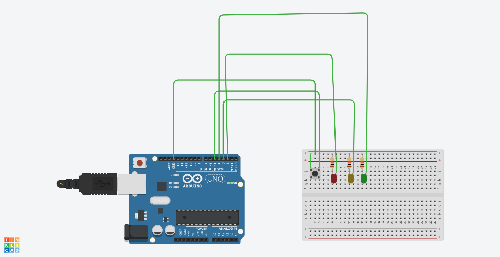

# 🚦 Traffic Light System using Arduino

A beginner-friendly simulation of a real-world **traffic signal system** using **Arduino Uno** and 3 LEDs. Demonstrates core embedded concepts like **digital output**, **timing logic**, and **real-time LED control**.

---

## 🔧 Hardware Used

| Component      | Quantity |
|----------------|----------|
| Arduino Uno     | 1        |
| Red LED         | 1        |
| Yellow LED      | 1        |
| Green LED       | 1        |
| 220Ω Resistors  | 3        |
| Breadboard      | 1        |
| Jumper Wires    | As needed |

✅ **Simulated in Tinkercad or real hardware**

---

## 🧠 How It Works

The program simulates a traffic signal by controlling 3 LEDs with delays:

1. 🔴 **Red ON** for 5 seconds  
2. 🟡 **Yellow ON** for 2 seconds  
3. 🟢 **Green ON** for 5 seconds  
4. 🔁 Then loops again

It uses `digitalWrite()` and `delay()` — the building blocks of real embedded timing control.

---

## 🖼️ Circuit Diagram

> 💡 Connect LEDs with resistors to avoid burning  
> - Red LED → Pin 8  
> - Yellow LED → Pin 9  
> - Green LED → Pin 10

---

## 💻 Arduino Code

📂 View the full code here:  
[`traffic_light.ino`](traffic_light1.ino)

---

## 📁 Project Files

| File Name            | Description             |
|---------------------|-------------------------|
| `traffic_light.ino`  | Arduino sketch (main code) |
| `traffic_light_circuit.png` | Circuit diagram image |
| `README.md`          | This file (documentation) |

---

## 🎯 What You’ll Learn

- ✅ Basics of **digital pin control**  
- ✅ Implementing **sequential logic**  
- ✅ Using **delay()** to control timing  
- ✅ Writing readable, structured Arduino code  
- ✅ Real-world traffic signal automation basics

---

## 🚀 Ideas for Future Upgrades

- 🚶 Add pedestrian crossing button with interrupt  
- 🔊 Add buzzer for crosswalk alerts  
- 🕒 Use **Real-Time Clock (RTC)** for scheduling  
- ⏱️ Add countdown using **7-segment** or **LCD display**  
- 🧠 Use `millis()` for non-blocking signal transitions

---

## 👨‍💻 Author

**Parth Pawar**  
🔗 [GitHub](https://github.com/parth-558)  
🔗 [LinkedIn](https://www.linkedin.com/in/parth-pawar-b82628248/)

> 🚀 “Building smart, real-world systems one circuit at a time!”

---

## 🏷️ Tags

`arduino`, `traffic light`, `led`, `beginner project`, `embedded`, `iot`, `tinkercad`, `timing`, `digitalWrite`, `automation`

---
